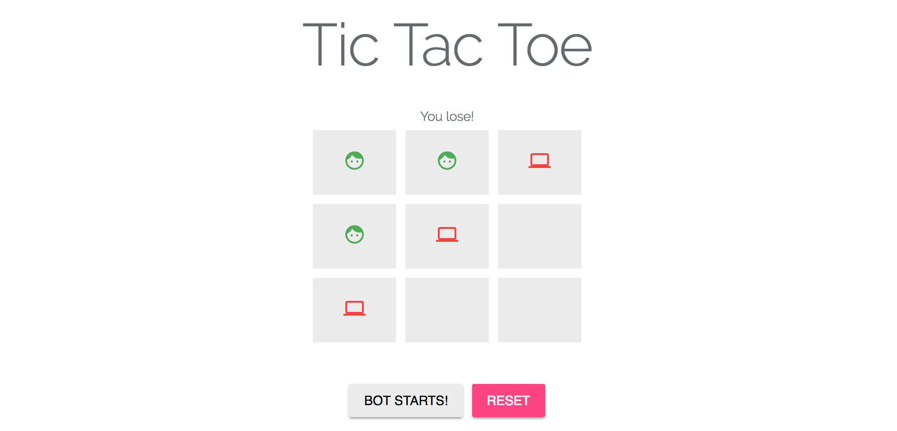
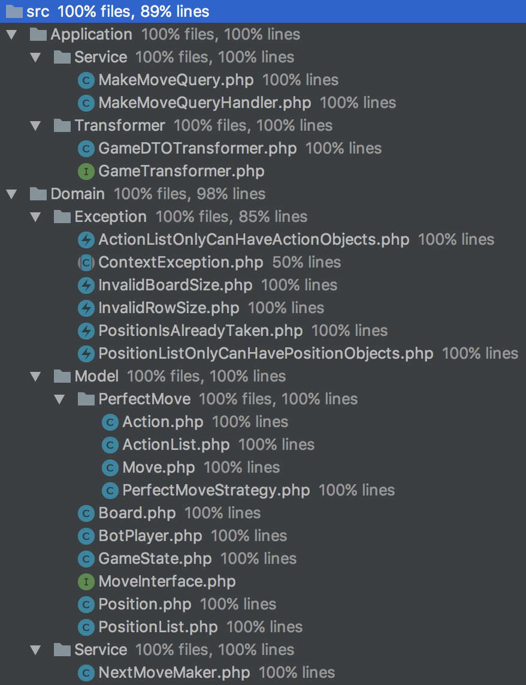

# Tic Tac Toe

Tic Tac Toe is an application with an API that can be called to make the moves, and a web interface, where the application can be visible.
You can try the [Online Demo of TicTacToe](http://tictactoe.nerusanti.com/).



## Technologies

The application use **Laravel** for the framework but it is made with **Hexagonal Architecture** so it is anecdotal. You can find all the **Application**, **Domain** and **Behavoiur** and **Unit tests** inside the folder ```src``` in the ```root``` folder.

For the **Acceptance** tests you can see them inside the folder ```tests/Acceptance```. These tests are separated because use the *test case* provided by Laravel.

## Entry Point

The entry point is a **post** request to ```/api/play```. It uses the routing and controllers provided by Laravel. You can find them in ```/routes/api.php``` and ```/app/Http/Controllers/ApiController.php```.

Inside the controller you can see that I am using [Tactitian](https://tactician.thephpleague.com/) for **CQRS** and handle the **Use cases** inside ```src/Application/Service```.

For the web interface the controller is ```/app/Http/Controllers/Home``` and the route path is inside ```/routes/web.php``` but there are not any logic here. All the front-end is made with [Vue.js](https://vuejs.org/).

## DDD

You can find all the code inside `/src` folder.

### Application

Here you can find the use cases (`Service` folder) and data transformer (`Transformer`).

### Domain

Here we have to distinguish between **Domain Model** and **Domain Service**.

The **NextMoveMaker** service (`/src/Domain/Service` folder) is the domain entry point and it is called from the *use case* (entry point to the application layer).

Basically the domain has a **GameState** with the state of the **Board** and a **BotPlayer** that have injected a `MoveInterface` **strategy** in order to manage the difficulty.

## Web Interface

You can find the assets (js and css) inside `/resources/assets` and the **welcome** view in `/resources/views`.

## Installation

If you are using [Laravel Homeasted](https://laravel.com/docs/5.5/homestead) will be very easy to run the application. If not you have to be sure that have pre-installed all the [server requirements](https://laravel.com/docs/5.4/installation#server-requirements).

### Server Requirements
* PHP >= 7.0.0

### Composer
`composer install`

### Public Directory

You should configure your web server's document / web root to be the `public` directory. The `index.php` in this directory serves as the front controller for all HTTP requests entering your application.

### Configuration Files

All of the configuration files for the Laravel framework are stored in the `config` directory.

### Directory Permissions

After installing Laravel, you may need to configure some permissions. Directories within the `storage` and the `bootstrap/cache` directories should be writable by your web server or Laravel will not run.

### Application Key

The next thing you should do after installing Laravel is set your application key to a random string. This key has already been set for you by the `php artisan key:generate` command.

Typically, this string should be 32 characters long. The key can be set in the `.env` environment file. If you have not renamed the `.env.example` file in the root directory to `.env`, you should do that now. **If the application key is not set, your user sessions and other encrypted data will not be secure!**

## Tests

### Behaviour and Unit Tests

This test could be find inside the folder `src/Tests/`. Here you can find the *Stub* used to avoid instantiate the classes inside the tests and if I change something during the development process I don't have to modify all the test, only the stub.

### Acceptance Tests

Because I use the **Test Case** from Laravel that help me to make **post** request, these are outside the **src** folder. You can find them inside the folder `tests/Acceptance` in the root folder.

### Coverage

The coverage it is practically the 100%. I am not using the ContextException in test because I had not logged any but I am used to having this kind of exception so I've already prepared the code with this.



